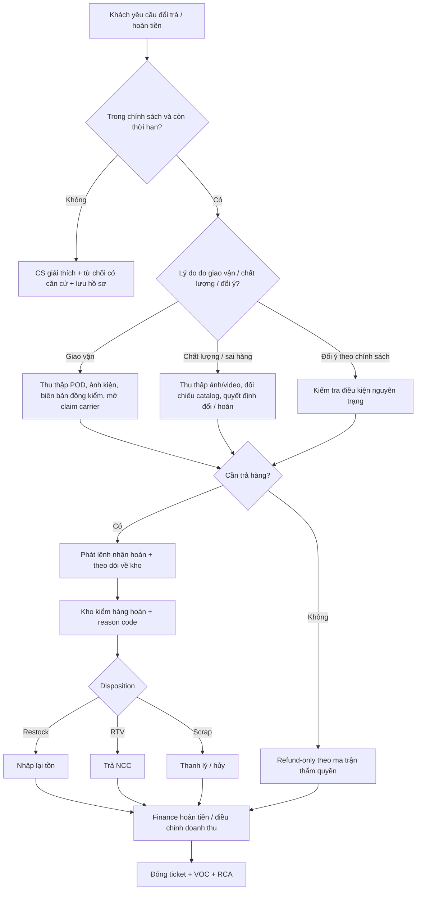

# Bộ SOP toàn diện cho công ty thương mại điện tử điển hình tại Việt Nam

## Tóm tắt điều hành

Bộ SOP này được thiết kế như một “operating system” hoàn chỉnh cho một công ty thương mại điện tử điển hình tại Việt Nam, theo mô hình bán lẻ số kết hợp website/app riêng, gian hàng trên sàn, vận hành kho nội bộ hoặc thuê 3PL, thanh toán COD và trả trước, và có nhu cầu quản trị đầy đủ từ chiến lược đến giao hàng, hậu mãi, tài chính, pháp chế, nhân sự và công nghệ. Đây là bộ khung dùng để triển khai, chuẩn hóa và kiểm soát doanh nghiệp trong bối cảnh pháp lý Việt Nam hiện hành về thương mại điện tử, bảo vệ người tiêu dùng, bảo vệ dữ liệu cá nhân, hóa đơn điện tử, giao dịch điện tử và an ninh mạng. citeturn0search1turn2search1turn12search8turn1search5turn0search8turn1search2turn11search2turn12search3

Về giả định, báo cáo áp dụng cho trường hợp **“không có ràng buộc cụ thể”** như người dùng yêu cầu. Vì vậy, tôi giả định doanh nghiệp bán hàng hóa tiêu dùng nói chung, không thuộc nhóm ngành có giấy phép/chứng nhận bổ sung như dược, thực phẩm chức năng, mỹ phẩm có công bố riêng, rượu, thuốc lá, thiết bị y tế, hóa chất nguy hiểm hoặc hàng nhập khẩu có quản lý chuyên ngành. Với các ngành này, bộ SOP dưới đây vẫn dùng được làm nền, nhưng phải bổ sung phụ lục tuân thủ theo ngành hàng. Đây cũng là bộ khung cho **website/app bán hàng** và/hoặc **mô hình marketplace/cung cấp dịch vụ TMĐT**; khác biệt pháp lý quan trọng là website/app bán hàng phải thực hiện **thông báo**, còn website/app cung cấp dịch vụ TMĐT phải **đăng ký** với Bộ Công Thương; đồng thời các chủ thể vận hành website/app thuộc diện phải báo cáo tình hình hoạt động TMĐT qua hệ thống của Bộ Công Thương, hiện có hướng dẫn thực hiện trên Online.gov.vn. citeturn2search1turn2search5turn14search3turn14search5turn12search8turn12search2

Về mặt điều hành, doanh nghiệp TMĐT hiệu quả cần vận hành theo ba lớp đồng thời. Lớp thứ nhất là **thương mại và tăng trưởng**: chiến lược, hàng hóa, nhà cung cấp, nội dung sản phẩm, giá và marketing. Lớp thứ hai là **fulfillment và doanh thu**: tồn kho, kho vận, đơn hàng, giao nhận, đổi trả, thanh toán và chăm sóc khách hàng. Lớp thứ ba là **nền tảng và kiểm soát**: công nghệ, dữ liệu, bảo mật, tài chính, pháp chế, nhân sự và mua sắm nội bộ. Vì TMĐT là hoạt động phụ thuộc dữ liệu liên tục, SOP phải được viết như tài liệu sống, có owner, chu kỳ review, phiên bản, KPI, SLA, checkpoint chất lượng, luồng bàn giao và đường leo thang rõ ràng. Cách làm này cũng phù hợp với các khuyến nghị thực hành SOP và process documentation có cấu trúc của Asana và Process Street. citeturn13search0turn13search12turn13search17

Ở tầng pháp lý cốt lõi, bộ SOP này được neo vào các nghĩa vụ quan trọng sau: minh bạch thông tin trên website/app và thủ tục thông báo/đăng ký TMĐT; quy trình tiếp nhận và giải quyết phản ánh, khiếu nại và trả hàng/hoàn tiền để bảo vệ người tiêu dùng; cơ chế xin đồng ý, thông báo mục đích xử lý và quản trị quyền của chủ thể dữ liệu theo Nghị định bảo vệ dữ liệu cá nhân; vận hành hóa đơn điện tử, chứng từ, thời điểm lập hóa đơn và đối soát theo quy định thuế; công nhận tính pháp lý của giao dịch điện tử, lưu trữ chứng từ điện tử; và áp dụng biện pháp kiểm soát an ninh mạng, phân quyền tối thiểu, MFA, nhật ký hệ thống và quy trình ứng phó sự cố. citeturn0search1turn1search5turn0search8turn1search2turn2search0turn12search3turn11search2turn6search1turn6search2turn6search16

Bộ SOP dưới đây vì vậy không chỉ là tài liệu “hướng dẫn thao tác”, mà là một bộ **cơ chế quản trị vận hành**: ai quyết định, ai thực hiện, hệ thống nào là nguồn dữ liệu gốc, khi nào được bàn giao trạng thái, đạt/chưa đạt ở cổng chất lượng nào, rủi ro chính là gì, kiểm soát nào bắt buộc có, và chỉ số nào dùng để đo hiệu quả.

## Mô hình tổ chức và phân công trách nhiệm

Mô hình tổ chức đề xuất cho công ty TMĐT điển hình tại Việt Nam nên xoay quanh một trục P&L thống nhất, dưới CEO hoặc Tổng giám đốc, với các khối chính: Thương mại, Vận hành, Tăng trưởng, Công nghệ & Dữ liệu, Tài chính & Pháp chế, Nhân sự & Hành chính. Với doanh nghiệp có tổ chức bán trên website/app riêng và cả sàn, nên có một đầu mối **Omnichannel Operations** để bảo đảm giá, tồn kho, khuyến mại, nội dung và chính sách CSKH nhất quán giữa các kênh. Về tuân thủ, trách nhiệm cần nằm trong tuyến phòng thủ rõ ràng: đội vận hành chịu trách nhiệm thực hiện; các đầu mối chức năng như pháp chế, tài chính, bảo mật xây khung kiểm soát; và lãnh đạo cùng kiểm toán nội bộ hoặc kiểm tra định kỳ chịu trách nhiệm giám sát. Mô hình này bám sát thực tế quản lý website/app TMĐT, báo cáo hoạt động TMĐT và quản trị dữ liệu cá nhân tại Việt Nam. citeturn12search8turn12search2turn0search8turn11search2

```mermaid
flowchart TD
    CEO[CEO / Tổng giám đốc]
    CEO --> STRAT[Chiến lược & PMO]
    CEO --> COMM[Khối Thương mại]
    CEO --> OPS[Khối Vận hành]
    CEO --> GROW[Khối Tăng trưởng]
    CEO --> TECH[Khối Công nghệ & Dữ liệu]
    CEO --> FINLEG[Khối Tài chính - Pháp chế - Compliance]
    CEO --> HRADM[Khối Nhân sự - Hành chính]

    COMM --> SRC[Mua hàng / Sourcing]
    COMM --> VEND[Vendor Management]
    COMM --> CAT[Quản trị Catalog]
    COMM --> PRICE[Giá & Khuyến mại]

    OPS --> INV[Inventory / WMS]
    OPS --> WH[Kho: nhận hàng - putaway - pick/pack]
    OPS --> OM[Order Management]
    OPS --> PAY[Đối soát thanh toán / Fraud]
    OPS --> LOG[Logistics / Last-mile]
    OPS --> CS[Customer Service / CRM]

    GROW --> SEO[SEO / Content]
    GROW --> ADS[Paid Ads / Performance]
    GROW --> CRMKT[CRM Marketing / Loyalty]

    TECH --> DEV[Application / DevOps]
    TECH --> SEC[Security / IAM]
    TECH --> DATA[BI / Analytics / Data Engineering]

    FINLEG --> FIN[Finance / Accounting / Tax]
    FINLEG --> LEGAL[Legal / Consumer Protection / PDPD]

    HRADM --> HR[Recruiting / C&B / L&D]
    HRADM --> PROC[Procurement / Office Ops]
```

Bảng dưới đây mô tả **trách nhiệm chính theo phòng ban**. Đây là ma trận vận hành đề xuất; nơi có nghĩa vụ pháp lý hoặc ràng buộc nền tảng, tôi nêu rõ trong phần ghi chú sau bảng.  

| Bộ phận | Mandate chính | Quyết định sở hữu | Deliverable trọng yếu | Điểm bàn giao chính |
|---|---|---|---|---|
| Chiến lược & PMO | Kế hoạch năm/quý, ngân sách, OKR, governance | Ưu tiên danh mục, ngân sách, CAPEX/OPEX lớn | Kế hoạch kinh doanh, roadmap, biên bản điều hành | Sang Thương mại, Tăng trưởng, Vận hành |
| Mua hàng / Sourcing | Tìm nguồn, đàm phán, PO, kế hoạch nhập | Chọn vendor, MOQ, lead time, điều khoản | Danh mục nguồn hàng, PO, lịch nhập | Sang Vendor, Kho, Finance |
| Vendor Management | Onboarding, scorecard, audit, claim | Duy trì/treo/chấm dứt vendor | Hồ sơ NCC, KPI vendor, CAPA | Sang Mua hàng, Pháp chế, Finance |
| Catalog | Master data, phân loại, nội dung, hình ảnh | SKU chuẩn, taxonomy, publish gate | SKU master, PDP, dữ liệu feed | Sang Website/App, Sàn, SEO |
| Giá & Khuyến mại | Giá bán, margin, markdown, campaign | Price ladder, deal funding, guardrail | Bảng giá, lịch khuyến mại, approval log | Sang Catalog, Ads, CS, Finance |
| Inventory / WMS | Tồn kho, allocation, reorder, stock health | Safety stock, reserve, replenishment | Tồn chính xác, báo cáo aging, đề xuất mua | Sang OM, Kho, Finance |
| Kho vận nội bộ | Nhận hàng, putaway, pick, pack, dispatch, returns | Vị trí lưu trữ, wave, packing rule | OTIF nội kho, biên bản lệch, hàng hoàn | Sang Logistics, CS, Finance |
| Order Management | Orchestration đơn hàng, trạng thái, exception | Hold/release/cancel/re-route | Đơn sạch, phân bổ đúng kho/kênh | Sang Kho, Thanh toán, CS |
| Thanh toán & Fraud | PSP reconciliation, COD recon, chargeback, review fraud | Rule fraud, manual review, refund release | Báo cáo đối soát, danh sách ngoại lệ | Sang Finance, CS, Tech |
| Logistics / Last-mile | SLA giao hàng, đối tác vận chuyển, NDR/RTO | Chọn carrier, routing, claim logistics | Tỷ lệ giao thành công, TAT giao hàng | Sang CS, Finance, Analytics |
| CS / CRM | Hỗ trợ trước-sau bán, khiếu nại, đổi trả, VOC | Bồi hoàn theo quyền hạn, escalation | SLA phản hồi, CSAT, root cause VOC | Sang Ops, Marketing, Legal |
| Marketing / SEO / Ads / Content | Traffic, conversion, content, CRM marketing | Phân bổ ngân sách, creative, campaign | Doanh thu marketing, CAC, SEO growth | Sang Catalog, Finance, CS |
| Tech / DevOps / Security / Data | Hệ thống, ETL, monitoring, bảo mật, BI | Release, incident tier, access control | Uptime, dashboard, audit logs | Sang toàn công ty |
| Finance / Accounting / Tax | Ghi nhận doanh thu, AP/AR, invoicing, tax | Chính sách ghi nhận, khóa sổ | BCTC quản trị, sổ cái, tờ khai | Sang CEO, Các khối |
| Legal / Compliance | Điều khoản, chính sách, consumer protection, PDPD | Legal approval, risk acceptance | Policy, legal review, compliance register | Sang mọi phòng ban |
| HR / Recruiting / Training | Tuyển dụng, C&B, đào tạo, đánh giá | Headcount, JD, lương, performance cycle | HCNS, hồ sơ nhân sự, ma trận năng lực | Sang CEO, các trưởng bộ phận |
| Procurement / Office Ops | Mua sắm nội bộ, tài sản, vendor office | Phê duyệt mua sắm, quản lý tài sản | PR/PO nội bộ, asset register | Sang Finance, IT, HR |

**Ghi chú tuân thủ cho toàn sơ đồ tổ chức.** Website/app bán hàng và website/app cung cấp dịch vụ TMĐT chịu các thủ tục thông báo/đăng ký khác nhau trên hệ thống của Bộ Công Thương; chủ thể vận hành còn có trách nhiệm báo cáo hoạt động TMĐT theo yêu cầu. Luật Bảo vệ quyền lợi người tiêu dùng 2023 có hiệu lực từ ngày 01/7/2024 và Nghị định 55/2024/NĐ-CP là lớp kiểm soát bắt buộc cho thông tin hàng hóa, điều kiện giao dịch, xử lý khiếu nại và bảo vệ người tiêu dùng trên môi trường số. citeturn2search1turn14search3turn12search8turn12search2turn1search5turn1search1

## Kiến trúc vận hành đầu cuối, dữ liệu, handoff và escalation

Vận hành TMĐT nên được thiết kế theo nguyên tắc **một nguồn dữ liệu gốc cho mỗi đối tượng nghiệp vụ**. Ví dụ: ERP/PIM là nguồn gốc của master data sản phẩm; OMS là nguồn gốc của trạng thái đơn hàng; WMS là nguồn gốc của trạng thái kho và tồn thực tế; hệ PSP/cổng thanh toán là nguồn gốc kết quả thanh toán; CRM/ticketing là nguồn gốc tương tác khách hàng; data warehouse là lớp báo cáo dùng để tổng hợp chứ không phải nơi nhập liệu tác nghiệp. Điều này đặc biệt quan trọng khi doanh nghiệp dùng nền tảng bán hàng đa kênh ở Việt Nam như Haravan hoặc Sapo, các hệ thống này đều nhấn mạnh khả năng đồng bộ đơn hàng, tồn kho, vận chuyển và dữ liệu cửa hàng qua API/tích hợp; còn với thanh toán điện tử, MoMo và ZaloPay đều cung cấp cơ chế thông báo kết quả thanh toán/callback để đồng bộ trạng thái về hệ merchant. citeturn4search3turn4search4turn4search16turn5search4turn5search12

```mermaid
flowchart LR
    A[Forecast nhu cầu] --> B[Mua hàng / PO]
    B --> C[Nhà cung cấp giao hàng]
    C --> D[Receiving & QC]
    D --> E[Putaway / Available stock]
    E --> F[Catalog + Giá + Tồn đồng bộ]
    F --> G[Khách đặt hàng Website/App/Sàn]
    G --> H[Fraud/Payment check]
    H --> I[OMS phân bổ kho/carrier]
    I --> J[Pick]
    J --> K[Pack]
    K --> L[Dispatch]
    L --> M[Giao hàng]
    M --> N[Đã giao / COD remittance]
    N --> O[Đối soát - Hóa đơn - Ghi nhận doanh thu]
    M --> P[Thất bại / Return / Refund]
    P --> Q[Kho hàng hoàn + QC]
    Q --> R[Restock / RTV / Scrap]
    R --> S[Phân tích VOC - RCA - Cải tiến]
```

**Luồng dữ liệu đề xuất**  

| Đối tượng dữ liệu | System of record | Hệ tích hợp đi/đến | Tần suất | Kiểm soát bắt buộc |
|---|---|---|---|---|
| Master SKU, thuộc tính, danh mục | PIM/ERP | Website, app, sàn, Merchant Center, ads feed | Near real-time hoặc theo batch giờ | SKU unique, taxonomy chuẩn, bắt buộc thuộc tính, approval publish |
| Giá, khuyến mại, cost, margin guardrail | Pricing engine/ERP | Website/app/sàn/POS | Real-time trước giờ campaign | 4-eyes approval, log thay đổi, mô phỏng margin |
| Tồn khả dụng, reserved, damaged | WMS | OMS, storefront, sàn | Near real-time | Reconcile tồn logic với tồn thực, chặn oversell |
| Đơn hàng, trạng thái, split shipment | OMS | WMS, CRM, Finance, BI | Real-time | Idempotency, SLA handoff, exception queue |
| Kết quả thanh toán, webhook/IPN | PSP/Payment gateway | OMS, Finance, anti-fraud | Real-time | Verify chữ ký/callback key, retry, unmatched queue |
| Phiếu nhập/xuất, hàng hoàn | WMS | ERP, Finance | Real-time | Chốt ca, cycle count, reason code chuẩn |
| Ticket CSKH, VOC, refund | CRM | OMS, WMS, BI | Real-time | SLA, QA audit, root cause taxonomy |
| Nhật ký hệ thống, thông tin truy cập | SIEM/Log mgmt | Security, DevOps | Streaming | Tamper-evident logs, retention, least privilege |
| Dữ liệu phân tích | DWH/BI | Dashboards, planning | Theo batch hoặc streaming | Data dictionary, quality tests, owner |

Thiết kế nội dung sản phẩm nên bám cả yêu cầu vận hành và khả năng hiển thị tìm kiếm. Google khuyến nghị website TMĐT cung cấp dữ liệu sản phẩm có cấu trúc, product/merchant listing markup, feed sản phẩm và khả năng kiểm thử rich results để cải thiện cách máy tìm kiếm hiểu trang và hiển thị thông tin mua hàng. Điều đó có nghĩa là SOP catalog không thể tách rời SOP SEO và data governance. citeturn10search0turn10search2turn10search7turn10search19turn10search14

**Nguyên tắc handoff và escalation dùng chung**  
Mọi handoff giữa bộ phận phải có 5 thành phần cố định: mã đối tượng; trạng thái hiện tại; owner tiếp theo; SLA tiếp nhận; và bằng chứng/snapshot để truy nguyên. Escalation dùng ba cấp. Cấp một là trưởng nhóm trong vòng vận hành hiện trường. Cấp hai là trưởng bộ phận chức năng khi quá SLA hoặc có rủi ro tài chính/chất lượng. Cấp ba là war room liên phòng ban do PMO hoặc COO chủ trì khi ảnh hưởng diện rộng doanh thu, khách hàng, pháp lý hoặc an ninh. Các ticket liên quan dữ liệu cá nhân, gian lận thanh toán, sự cố hệ thống và nguy cơ khiếu nại người tiêu dùng phải được đánh mức ưu tiên cao ngay từ lúc mở ticket do nghĩa vụ bảo vệ dữ liệu, consumer protection và an ninh mạng. citeturn0search8turn1search5turn11search2turn6search2turn6search16

## Bộ SOP cho khối thương mại và tăng trưởng

Khối này chịu trách nhiệm “bán đúng hàng, đúng giá, đúng nội dung, đúng kênh, đúng đối tượng”. Tại Việt Nam, phần lớn rủi ro ở khối này không chỉ là dùng sai chiến lược thương mại mà còn là đăng thông tin sai/thiếu trên website/app, khuyến mại không qua legal review khi cần, feed sản phẩm không đồng bộ, và nội dung sản phẩm không đủ để đáp ứng yêu cầu minh bạch với người tiêu dùng cũng như điều kiện hiển thị trên nền tảng tìm kiếm/quảng cáo. citeturn0search1turn1search5turn10search0turn10search4turn10search19

**SOP lãnh đạo và chiến lược**  
**Mục đích và phạm vi:** xác lập chiến lược tăng trưởng, danh mục, ngân sách, năng lực vận hành và governance toàn công ty theo chu kỳ năm/quý/tháng. Áp dụng cho CEO, Ban điều hành, Finance, PMO và trưởng khối.  
**Định nghĩa:** north-star metric, P&L, contribution margin, OOS, NFR, VOC, CAPA.  
**Vai trò và năng lực:** CEO/P&L owner; PMO có năng lực lập kế hoạch, quản trị OKR, risk register; Finance hỗ trợ modeling; Data hỗ trợ dashboard.  
**Quy trình:** đầu quý, PMO khóa dữ liệu kỳ trước; Finance phát hành flash P&L; Data công bố dashboard chuẩn; từng khối nộp forecast, nhu cầu headcount và risk register; CEO họp S&OP/IBP cấp điều hành; quyết định được ghi thành quyết nghị có owner, deadline, KPI và trigger review; giữa quý thực hiện business review, cuối quý thực hiện post-mortem.  
**Inputs / outputs:** input gồm P&L quản trị, dashboard đơn hàng, tồn kho, marketing, VOC, risk log; output gồm OKR quý, ngân sách, capex/opex plan, danh mục ưu tiên, quyết định stop/scale.  
**Biểu mẫu:** mẫu OKR quý; mẫu portfolio review; mẫu risk register; template biên bản quyết nghị.  
**KPI / SLA đề xuất:** forecast accuracy doanh thu; ngân sách lệch không quá ngưỡng đã phê duyệt; 100% quyết nghị có owner và due date; business review hàng tuần cố định.  
**Rủi ro / kiểm soát:** quyết định dựa trên dữ liệu không nhất quán; kiểm soát bằng dashboard chuẩn hóa, data dictionary, một nguồn dữ liệu gốc và version control tài liệu.

**SOP sourcing và procurement hàng hóa**  
**Mục đích và phạm vi:** bảo đảm có nguồn hàng đáp ứng chất lượng, giá vốn, lead time, MOQ, điều khoản thanh toán và hồ sơ pháp lý phù hợp. Áp dụng cho mua hàng nội địa; với nhập khẩu cần thêm phụ lục customs/compliance.  
**Vai trò và năng lực:** Sourcing Manager, Buyer, QC, Legal, Finance; cần năng lực đàm phán, cost modeling, đánh giá vendor, Incoterms cơ bản nếu nhập khẩu, và biết đọc test report/chứng từ chất lượng khi có.  
**Quy trình:** nhận forecast và open-to-buy; rà soát tồn kho, aging và plan khuyến mại; phát RFQ/RFP; so sánh total landed cost; kiểm tra hồ sơ pháp lý, chứng từ chất lượng, mẫu thử; thương lượng MOQ, lead time, rebate, điều khoản bồi thường; trình duyệt NCC; phát PO; theo dõi ASN/lịch giao; close PO sau nhận hàng và đối soát hóa đơn.  
**Inputs / outputs:** forecast, target margin, vendor list, scorecard; output là vendor shortlist, hợp đồng/PO, lịch nhập, cost sheet.  
**Biểu mẫu:** RFQ, vendor comparison matrix, cost sheet, PO template, approved vendor list.  
**KPI / SLA đề xuất:** fill rate PO; PPV; OTIF inbound; tỷ lệ từ chối lô hàng; lead time deviation.  
**Rủi ro / kiểm soát:** chất lượng không đồng đều, thiếu hồ sơ, lead time trượt; kiểm soát bằng mẫu duyệt 3 bước, test mẫu, điều khoản QC/penalty, dual sourcing cho top SKU.

**SOP vendor management**  
**Mục đích và phạm vi:** quản lý vòng đời nhà cung cấp từ onboarding đến đánh giá định kỳ và xử lý CAPA.  
**Vai trò và năng lực:** Vendor Manager, Legal, Finance AP, QC.  
**Quy trình:** mở hồ sơ NCC; thu thập MST, đăng ký kinh doanh, người đại diện, tài khoản thanh toán, hợp đồng mẫu, SLA, cam kết chất lượng; gán mức rủi ro; chấm điểm định kỳ theo OTIF, defect, claim ratio, cost competitiveness; nếu kém chuẩn thì mở CAPA; nếu rủi ro cao thì tạm dừng PO mới.  
**Inputs / outputs:** hồ sơ pháp lý, hiệu năng giao hàng, claim log; output là scorecard, trạng thái active/watchlist/suspend.  
**Biểu mẫu:** vendor onboarding checklist, scorecard, CAPA form, blacklist/watchlist register.  
**KPI / SLA đề xuất:** 100% NCC có hồ sơ cập nhật; vendor OTIF; defect ppm; thời gian đóng CAPA.  
**Rủi ro / kiểm soát:** fake vendor, thanh toán sai tài khoản, phụ thuộc một NCC; kiểm soát bằng KYC vendor, xác minh tài khoản, thay đổi bank account cần callback độc lập.

**SOP catalog management**  
**Mục đích và phạm vi:** tạo và duy trì “single source of truth” cho toàn bộ dữ liệu sản phẩm trên website/app/sàn/feed quảng cáo.  
**Vai trò và năng lực:** Catalog Manager, Content Writer, Graphic Designer, Photography, SEO, Legal reviewer khi cần.  
**Quy trình:** tạo SKU master; gán taxonomy; chuẩn hóa thuộc tính bắt buộc; sản xuất mô tả, ảnh, video, bảng thông số; map thuộc tính cho từng kênh; kiểm tra chính sách listing; kiểm tra dữ liệu có cấu trúc cho website; publish; chạy vòng QA hậu publish; theo dõi lỗi feed và chỉnh sửa. Google khuyến nghị product structured data, merchant listing markup và feed sản phẩm để cải thiện hiển thị và độ chính xác hiểu nội dung; với hệ thống bán đa kênh tại Việt Nam, năng lực đồng bộ SKU-tồn-giá giữa hệ quản trị và sàn là yếu tố cốt lõi. citeturn10search0turn10search2turn10search7turn10search19turn4search4turn4search16  
**Inputs / outputs:** cost, hình ảnh, thuộc tính, pháp lý, giá; output là PDP sạch, feed sạch, SKU publish-ready.  
**Biểu mẫu:** SKU master sheet, taxonomy guide, PDP checklist, image brief, content QA checklist.  
**KPI / SLA đề xuất:** catalog completeness; feed error rate; time-to-publish; content refresh cycle cho top seller.  
**Rủi ro / kiểm soát:** sai mô tả dẫn đến khiếu nại/hoàn hàng; kiểm soát bằng gate kiểm tra thuộc tính bắt buộc, review 4 mắt, snapshot phiên bản nội dung.

**SOP giá và khuyến mại**  
**Mục đích và phạm vi:** thiết lập giá bán, biên lợi nhuận, cơ chế markdown, bundle, voucher, flash sale và kiểm soát tính hợp pháp/chính xác của chương trình.  
**Vai trò và năng lực:** Pricing Manager, Commercial, Finance, Legal, Marketing.  
**Quy trình:** xác định cost-to-serve; đặt floor margin và guardrail theo nhóm hàng/kênh; mô phỏng tác động của voucher/free-ship/co-funding; legal review chương trình đặc thù; duyệt lịch giá và khuyến mại; khóa cấu hình; sau chiến dịch rà soát gross margin, net margin và cannibalization. Trong bối cảnh Việt Nam, hoạt động khuyến mại phải đi qua bước rà soát pháp lý nội bộ; với một số hình thức như khuyến mại mang tính may rủi có yêu cầu đăng ký/thủ tục qua cơ quan có thẩm quyền theo hướng dẫn trên cổng dịch vụ công Bộ Công Thương. citeturn15search1turn15search4  
**Inputs / outputs:** cost sheet, market price, campaign plan; output là price book, promotion calendar, approval log.  
**Biểu mẫu:** price change request, promotion approval form, margin simulation sheet.  
**KPI / SLA đề xuất:** margin after promo; promo ROI; price mismatch rate; số lỗi cấu hình giá.  
**Rủi ro / kiểm soát:** giá âm, lỗ ngoài ý muốn, giá lệch giữa kênh; kiểm soát bằng rule engine, sandbox test, hai cấp duyệt với campaign lớn.

**SOP marketing, SEO, ads, content và CRM marketing**  
**Mục đích và phạm vi:** tạo lưu lượng, tối ưu chuyển đổi, tái mua và tăng CLV.  
**Vai trò và năng lực:** Growth Lead, SEO, Performance Ads, CRM specialist, Content, Designer, Analyst.  
**Quy trình:** lập kế hoạch theo funnel; nhận feed sản phẩm sạch từ Catalog; map landing page và UTM chuẩn; triển khai SEO on-page, structured data, Merchant Center, Search Console; chạy ads theo trục profit hoặc contribution margin; thiết lập CRM automation cho abandoned cart, win-back, post-purchase; họp weekly channel review; cắt hoặc scale campaign theo rule. Google nêu rõ Merchant Center là công cụ miễn phí để tải và quản lý data sản phẩm hiển thị trên nhiều bề mặt Google; product data và structured data được dùng cho free listings, Shopping ads và các hiển thị liên quan sản phẩm. citeturn10search1turn10search4turn10search2turn10search6turn10search17  
**Inputs / outputs:** catalog feed, price, stock, audience segments, creative assets; output là traffic đủ điều kiện, orders, cohort retention report.  
**Biểu mẫu:** campaign brief, keyword/content brief, UTM taxonomy, SEO QA checklist, lifecycle CRM calendar.  
**KPI / SLA đề xuất:** CAC/NCAC; MER/ROAS; CVR; organic sessions; repeat rate; email/SMS revenue share.  
**Rủi ro / kiểm soát:** chạy ads vào SKU out-of-stock, content claim quá mức, tracking lệch; kiểm soát bằng feed gating theo tồn, legal review claim nhạy cảm, governance tagging.

## Bộ SOP cho khối fulfillment, thanh toán, logistics và dịch vụ khách hàng

Đây là khối biến “ý định mua” thành “đơn đã giao, tiền đã thu và khách vẫn hài lòng”. Thực tế trên các nền tảng bán hàng lớn cho thấy hiệu quả vận hành bị chi phối mạnh bởi các biến số như tỷ lệ giao muộn, đơn không thành công, xử lý trả hàng/hoàn tiền, thời gian phản hồi khiếu nại và đối soát chính xác. Shopee hiện hướng dẫn người bán theo dõi tỷ lệ đơn không thành công và khuyến nghị duy trì tỷ lệ này dưới 2% để đạt hiệu quả bán hàng tốt; Shopee và TikTok Shop đều có các khung thời gian sau bán rõ ràng cho yêu cầu trả hàng/hoàn tiền. citeturn9search0turn9search4turn3search0turn3search5turn3search7

**SOP inventory / WMS**  
**Mục đích và phạm vi:** duy trì tồn kho chính xác, khả dụng, đủ bán và tối ưu vốn lưu động.  
**Vai trò và năng lực:** Inventory Manager, Planner, WMS Admin, Warehouse supervisor, Analyst.  
**Quy trình:** đồng bộ forecast và sales plan; tính min/max, safety stock, reorder point; phân loại ABC/XYZ; cấu hình reserve stock theo kênh; kiểm soát tồn giữ chỗ bởi OMS; cycle count theo tần suất rủi ro; xử lý chênh lệch tồn; review aging, near-expiry và dead stock; đề xuất markdown hoặc liquidation.  
**Inputs / outputs:** sales history, supplier lead time, return rate, stock aging; output là replenishment plan, stock health report, location inventory accuracy.  
**Biểu mẫu:** stock adjustment form, cycle count sheet, aging action tracker.  
**KPI / SLA đề xuất:** inventory accuracy; stock cover; OOS rate; aging; write-off ratio.  
**Rủi ro / kiểm soát:** oversell, tồn ảo, tồn già; kiểm soát bằng đồng bộ near real-time, cycle count dựa rủi ro, lock reason code cho điều chỉnh tồn.

**SOP kho: receiving, QC, putaway, picking, packing, dispatch, returns**  
**Mục đích và phạm vi:** chuẩn hóa vận hành kho đầu vào, lưu kho, xuất kho và hàng hoàn.  
**Vai trò và năng lực:** Receiving clerk, QC inspector, picker, packer, warehouse lead, return specialist.  
**Quy trình:**  
Nhận hàng: đối chiếu ASN/PO, kiểm số lượng, tình trạng bao bì, batch/serial nếu có, lập biên bản lệch.  
QC: kiểm AQL hoặc checklist theo nhóm hàng, chụp ảnh bằng chứng, quyết định accept/quarantine/reject.  
Putaway: gán vị trí, ghi nhận barcode, xác nhận vào WMS.  
Pick: tạo wave theo deadline carrier/channel, pick scan-to-confirm.  
Pack: đối chiếu SKU-số lượng, chọn vật liệu đóng gói theo rule, chèn chứng từ/thư cảm ơn nếu cần, in tem vận đơn.  
Dispatch: bàn giao carrier theo manifest, scan xác nhận.  
Returns: tiếp nhận hàng hoàn, kiểm tình trạng, reason code, quyết định restock/refurbish/RTV/scrap và mở claim nếu có. Các hướng dẫn seller của Shopee cho thấy địa chỉ nhận hàng hoàn, thời gian khiếu nại sau khi nhận hàng hoàn, biên bản đồng kiểm và bằng chứng mở hàng là những yếu tố then chốt để xử lý tranh chấp; đây là thực hành rất phù hợp để nội luật hóa vào SOP nội bộ dù doanh nghiệp bán trên website riêng hay sàn. citeturn3search3turn3search6turn3search8turn9search10  
**Inputs / outputs:** PO/ASN, sales order, return order; output là GRN, putaway confirmation, shipment confirmation, return disposition.  
**Biểu mẫu:** GRN, QC checklist, discrepancy report, packing checklist, return inspection form, carrier handover sheet.  
**KPI / SLA đề xuất:** dock-to-stock time; pick accuracy; packing defect rate; same-day dispatch cutoff; return processing TAT.  
**Rủi ro / kiểm soát:** nhận thừa/thiếu, pick sai hàng, đóng gói kém, hàng hoàn tráo đổi; kiểm soát bằng scan bắt buộc, CCTV khu đóng gói, opener video tại điểm nghi ngờ, biên bản đồng kiểm với carrier.

**SOP order management**  
**Mục đích và phạm vi:** nhận đơn, xác thực, phân bổ kho, điều phối xử lý ngoại lệ và quản trị trạng thái đơn hàng.  
**Vai trò và năng lực:** OMS Specialist, Inventory Planner, CS, Payment reviewer.  
**Quy trình:** ingest đơn từ website/app/sàn; chuẩn hóa địa chỉ và contact; kiểm tra duplicate; kiểm tra stock availability; chạy rule COD/prepaid/fraud; phân bổ kho theo quy tắc cost-to-serve và SLA; đẩy lệnh xuất kho; theo dõi các queue ngoại lệ như thiếu tồn, sai địa chỉ, thanh toán pending, khách yêu cầu sửa/hủy; phát tín hiệu proactive cho CS và khách.  
**Inputs / outputs:** order feed, payment events, stock availability; output là order released/held/cancelled/split.  
**Biểu mẫu:** exception queue template, order hold log, split order approval note.  
**KPI / SLA đề xuất:** order release within X phút sau payment success; % đơn auto-flow; exception aging; cancel-before-ship rate.  
**Rủi ro / kiểm soát:** đơn treo không ai xử lý, split sai, hủy do hết hàng; kiểm soát bằng queue owner rõ ràng, mắt thần dashboard, cutoff alarm.

**SOP đối soát thanh toán và phòng chống gian lận**  
**Mục đích và phạm vi:** bảo đảm trạng thái tiền khớp với trạng thái đơn, khóa thất thoát và kiểm soát gian lận/chargeback.  
**Vai trò và năng lực:** Payment Ops, Finance AR, Fraud analyst, Tech integration engineer.  
**Quy trình:** tiếp nhận webhook/IPN từ cổng thanh toán; xác minh chữ ký/bí mật callback; cập nhật trạng thái đơn idempotent; chạy batch đối soát T+0/T+1 với PSP và COD remittance; phân loại unmatched; mở điều tra fraud đối với đơn có dấu hiệu rủi ro; đóng khi có bằng chứng giao dịch/đơn hàng/vận chuyển; phát hành refund sau khi OMS/WMS xác nhận điều kiện. MoMo nêu rõ hệ thống sẽ thông báo kết quả giao dịch qua notification/IPN; ZaloPay cũng yêu cầu merchant xác thực callback bằng callback key; các cơ chế này nên được dùng như nguồn sự thật cho SOP payment ops. citeturn5search4turn5search12turn5search10  
**Inputs / outputs:** webhook PSP, bank statement, COD statement, order ledger; output là daily reconciliation report, refund file, fraud case log.  
**Biểu mẫu:** unmatched transaction sheet, fraud review checklist, refund authorization form.  
**KPI / SLA đề xuất:** % giao dịch đối soát tự động; unmatched aging; chargeback ratio; refund TAT; false-positive fraud rate.  
**Rủi ro / kiểm soát:** cập nhật nhầm trạng thái thanh toán, giả mạo callback, hoàn tiền trùng; kiểm soát bằng verify chữ ký, idempotency key, maker-checker cho refund, device/risk score.

**SOP logistics và last-mile**  
**Mục đích và phạm vi:** tối ưu TAT giao hàng, tỷ lệ phát thành công, chi phí vận chuyển và khiếu nại vận chuyển.  
**Vai trò và năng lực:** Logistics Manager, Carrier Manager, NDR team, CS liaison.  
**Quy trình:** cấu hình carrier matrix theo vùng, trọng lượng, COD, hàng cồng kềnh, SLA; theo dõi pickup cutoff; giám sát first-mile và line-haul; xử lý NDR bằng call script và rule tái phát; quản trị RTO; theo dõi claim bồi thường hư hỏng/thất lạc; review carrier scorecard hàng tuần. Trên các sàn, các chỉ số như giao muộn, đơn không thành công và tranh chấp hàng hoàn liên quan trực tiếp đến hiệu quả người bán; vì vậy doanh nghiệp tự vận hành website riêng cũng nên xây scorecard last-mile tương đương chuẩn sàn. citeturn9search0turn9search4turn9search14turn9search12  
**Inputs / outputs:** shipment manifest, tracking updates, NDR codes, remittance; output là carrier scorecard, NDR list, claim log.  
**Biểu mẫu:** carrier SLA appendix, NDR call script, loss/damage claim form.  
**KPI / SLA đề xuất:** on-time delivery; first-attempt delivery success; NDR rate; RTO rate; cost per shipment.  
**Rủi ro / kiểm soát:** giao muộn, thất lạc, giả COD, chậm remittance; kiểm soát bằng multi-carrier routing, proof-of-delivery, đối soát COD độc lập, blacklisting address pattern rủi ro.

**SOP customer service và CRM sau bán**  
**Mục đích và phạm vi:** giải đáp, xử lý khiếu nại, hỗ trợ đổi trả/hoàn tiền, duy trì CLV và chuyển VOC thành cải tiến vận hành.  
**Vai trò và năng lực:** CS agent, team lead, QA, Knowledge base owner, Escalation specialist.  
**Quy trình:** tiếp nhận đa kênh; mở ticket với taxonomy chuẩn; xác thực đơn/khách; tra cứu trạng thái OMS/WMS/Logistics; giải quyết cấp 1 nếu trong thẩm quyền; chuyển cấp nếu liên quan hoàn tiền, pháp lý, dữ liệu cá nhân hoặc hành vi gian lận; đóng ticket khi có xác nhận; lấy CSAT; đưa VOC vào weekly root-cause review. Luật bảo vệ người tiêu dùng 2023 và Nghị định 55/2024/NĐ-CP làm cho việc lưu bằng chứng thông tin giao dịch, điều kiện giao dịch chung, quy trình khiếu nại và xử lý minh bạch trở thành yêu cầu quản trị bắt buộc chứ không chỉ là “best practice”. Trong thực hành nền tảng, Shopee và TikTok Shop đều cho phép yêu cầu trả hàng/hoàn tiền trong cửa sổ 15 ngày sau giao thành công; điều này là benchmark tốt cho việc thiết kế chính sách website riêng nếu doanh nghiệp muốn cạnh tranh trải nghiệm. citeturn1search5turn1search1turn3search0turn3search5turn3search7  
**Inputs / outputs:** inquiry, ticket, order status, claim evidence; output là resolved ticket, refund/replace decision, VOC dashboard.  
**Biểu mẫu:** macro trả lời chuẩn, refund matrix, goodwill compensation table, VOC RCA template.  
**KPI / SLA đề xuất:** first response time; resolution time; CSAT; complaint recurrence; % ticket có root cause tag.  
**Rủi ro / kiểm soát:** agent trả lời sai chính sách, bồi hoàn quá quyền hạn, lộ dữ liệu khách hàng; kiểm soát bằng knowledge base versioned, QA sampling, role-based permissions.

## Bộ SOP cho công nghệ, dữ liệu, tài chính, pháp chế, nhân sự và mua sắm nội bộ

Khối nền tảng là “xương sống” của công ty TMĐT. Nếu khối này yếu, doanh nghiệp vẫn có thể tăng trưởng ngắn hạn nhưng sẽ vấp trần rất nhanh ở lỗi hệ thống, số liệu không khớp, rủi ro bảo mật, sai thuế, hồ sơ nhân sự thiếu, hoặc vi phạm nghĩa vụ người tiêu dùng/dữ liệu cá nhân. Tại Việt Nam, Nghị định 13/2023/NĐ-CP về bảo vệ dữ liệu cá nhân, Nghị định 53/2022/NĐ-CP hướng dẫn Luật An ninh mạng, Luật Giao dịch điện tử 2023, quy định hóa đơn điện tử và khung nghĩa vụ BHXH/lao động khiến lớp nền tảng này phải được SOP hóa rất nghiêm ngặt. citeturn0search8turn11search2turn12search3turn1search2turn2search0turn7search0turn7search6

**SOP IT, DevOps, security và data analytics**  
**Mục đích và phạm vi:** duy trì hệ thống ổn định, an toàn, đo được, và có khả năng khôi phục/giải trình.  
**Vai trò và năng lực:** Engineering Manager, DevOps/SRE, Security lead, Data engineer, BI analyst, Product owner.  
**Quy trình:** quản lý backlog theo ưu tiên kinh doanh; phát hành thay đổi qua CI/CD; yêu cầu peer review và rollback plan cho mọi release; giám sát uptime, error rate, queue lag; phân quyền theo nguyên tắc least privilege; bật MFA/phishing-resistant MFA khi có thể; ghi log ứng dụng và bảo mật; định kỳ review access; có runbook cho incident; post-mortem không đổ lỗi; dựng data quality checks cho pipeline. OWASP ASVS là khung yêu cầu kiểm thử bảo mật ứng dụng được dùng rộng rãi; OWASP Logging Cheat Sheet nhấn mạnh tầm quan trọng của application logging; NIST định nghĩa least privilege là chỉ cấp tối thiểu tài nguyên và quyền cần thiết; CISA khuyến nghị MFA để chặn truy cập trái phép. citeturn6search0turn6search12turn6search16turn6search1turn6search2turn6search10  
**Inputs / outputs:** PRD, code, release request, incident report, data model; output là production release, audit log, dashboard, incident RCA.  
**Biểu mẫu:** release checklist, change request, incident severity matrix, access request form, data quality checklist.  
**KPI / SLA đề xuất:** uptime; MTTA/MTTR; change failure rate; % access reviewed quarterly; data freshness SLA.  
**Rủi ro / kiểm soát:** broken access control, misconfiguration, thiếu log, rò rỉ dữ liệu; kiểm soát bằng MFA, least privilege, vault/secret management, security test trong pipeline, log retention và alerting.

**SOP finance, accounting và tax**  
**Mục đích và phạm vi:** bảo đảm ghi nhận doanh thu/chi phí đầy đủ, đối soát kênh bán và thanh toán chuẩn, hóa đơn/chứng từ hợp lệ, khóa sổ đúng hạn, thuế được kê khai đầy đủ.  
**Vai trò và năng lực:** Finance Controller, Chief Accountant, AR/AP, Tax specialist, Payment Ops.  
**Quy trình:** hàng ngày nhận sales ledger, refund ledger, payment settlements, COD remittance và shipment cost; đối soát 3 bên giữa OMS/PSP-bank/WMS-carrier; phát hành hóa đơn điện tử theo rule đã cấu hình; hạch toán doanh thu, chiết khấu, voucher, chi phí vận chuyển, hàng trả lại; khóa sổ monthly; tax review trước kỳ kê khai; lưu hồ sơ điện tử theo retention schedule. Quy định về hóa đơn điện tử hiện hành được neo bởi Nghị định 123/2020/NĐ-CP, Thông tư 78/2021/TT-BTC và văn bản sửa đổi tại Nghị định 70/2025/NĐ-CP; doanh nghiệp TMĐT cần biến các thay đổi này thành rule kế toán-vận hành cụ thể trong SOP. citeturn1search2turn2search4turn2search0  
**Inputs / outputs:** sales/refund ledger, bank statement, vendor invoice, payroll, tax documents; output là journal entries, e-invoices, AP/AR aging, management P&L, tax filings.  
**Biểu mẫu:** month-end close checklist, revenue reconciliation workbook, tax calendar, refund accounting memo.  
**KPI / SLA đề xuất:** monthly close TAT; unmatched transactions aging; AP on-time payment; số lỗi hóa đơn; chênh lệch đối soát.  
**Rủi ro / kiểm soát:** ghi nhận doanh thu sai kỳ, trùng hoàn tiền, lệch COD, sử dụng chứng từ sai; kiểm soát bằng maker-checker, close calendar, reconciliation automation, external sample audit.

**SOP legal, compliance và consumer protection**  
**Mục đích và phạm vi:** quản trị hợp đồng, điều kiện giao dịch, chính sách website/app, nghĩa vụ TMĐT, bảo vệ người tiêu dùng, bảo vệ dữ liệu cá nhân và quản trị yêu cầu cơ quan nhà nước.  
**Vai trò và năng lực:** Legal Counsel, Compliance Officer, DPO/Privacy lead, Consumer protection lead.  
**Quy trình:** lập compliance register; phân loại mô hình website/app để thực hiện thông báo hoặc đăng ký với Bộ Công Thương; thiết lập lịch báo cáo TMĐT; review Terms & Conditions, chính sách giao nhận/đổi trả, chính sách bảo mật và cookie/consent; thiết kế quy trình tiếp nhận/khiếu nại; tạo cơ chế tiếp nhận yêu cầu của chủ thể dữ liệu; duy trì hồ sơ xử lý dữ liệu, danh mục hệ thống và bên thứ ba; legal review chiến dịch, nội dung claim, nhà cung cấp và hợp đồng. Bộ Công Thương hiện hướng dẫn rõ website bán hàng phải thông báo; website/app cung cấp dịch vụ TMĐT phải đăng ký; các đơn vị vận hành còn phải báo cáo hoạt động TMĐT theo yêu cầu. Nghị định 13/2023/NĐ-CP đặt nền tảng cho việc xin đồng ý, thông báo và bảo vệ dữ liệu cá nhân. Luật bảo vệ người tiêu dùng 2023 và Nghị định 55/2024/NĐ-CP gia tăng kỳ vọng minh bạch đối với môi trường số. citeturn2search1turn14search3turn14search5turn12search8turn12search2turn0search8turn1search5turn1search1  
**Inputs / outputs:** hợp đồng, chính sách, product claims, incident notice, regulator requests; output là legal approval, compliance calendar, privacy notices, evidence packs.  
**Biểu mẫu:** legal review form, privacy impact checklist, DSAR intake form, regulator response tracker, compliance register.  
**KPI / SLA đề xuất:** 100% website/app đúng trạng thái pháp lý; 100% policy có owner và version; phản hồi DSAR/khiếu nại theo SLA nội bộ; zero overdue compliance filing.  
**Rủi ro / kiểm soát:** thiếu thông báo/đăng ký, chính sách mâu thuẫn thực tế, xử lý dữ liệu quá phạm vi; kiểm soát bằng annual compliance audit, version policy, approval matrix.

**SOP HR, recruiting, training và performance**  
**Mục đích và phạm vi:** tuyển đúng người, onboard nhanh, trả lương/phúc lợi đúng, đào tạo theo năng lực và duy trì kỷ luật vận hành.  
**Vai trò và năng lực:** HRBP, Talent Acquisition, C&B, L&D, Line managers.  
**Quy trình:** nhận approved headcount; mở requisition/JD; tuyển và phỏng vấn theo scorecard; pre-boarding và hồ sơ; day-1 onboarding; đào tạo bắt buộc gồm bảo mật, dữ liệu cá nhân, CSKH, PCCC/ATVSLĐ theo tính chất công việc; probation review; performance cycle; succession cho vị trí trọng yếu. Bộ luật Lao động 2019 là khung nền cho quan hệ lao động; tài liệu pháp lý của Bộ Tư pháp về an toàn, vệ sinh lao động nhấn mạnh nghĩa vụ huấn luyện; BHXH Việt Nam cho biết Luật BHXH 2024 có hiệu lực từ 01/7/2025 và kế thừa/bổ sung quy định về tham gia BHXH bắt buộc và thời hạn đóng. citeturn7search0turn7search1turn7search5turn7search6turn7search10  
**Inputs / outputs:** headcount plan, requisition, hồ sơ nhân sự, payroll input; output là offer, HĐLĐ, training record, performance review, payroll.  
**Biểu mẫu:** requisition form, interview scorecard, onboarding checklist, training matrix, PIP template.  
**KPI / SLA đề xuất:** time-to-fill; time-to-productivity; training completion; attrition; payroll accuracy.  
**Rủi ro / kiểm soát:** tuyển sai, hồ sơ thiếu, nhân sự kho/CS không nắm SOP; kiểm soát bằng scorecard tuyển dụng, bài test thao tác, certification trước khi đứng line.

**SOP procurement nội bộ và office operations**  
**Mục đích và phạm vi:** quản lý mọi mua sắm không phải hàng bán như thiết bị CNTT, vật tư văn phòng, dịch vụ thuê ngoài, tài sản cố định, quản trị hành chính.  
**Vai trò và năng lực:** Procurement Officer, Office Manager, IT asset admin, Finance AP.  
**Quy trình:** nhận PR; kiểm tra ngân sách; lấy báo giá; chọn NCC theo ngưỡng mua sắm; phát PO; nhận hàng/dịch vụ; nghiệm thu; ghi tăng asset khi cần; phân bổ người dùng/địa điểm; thanh toán; kiểm kê và thanh lý cuối vòng đời.  
**Inputs / outputs:** PR, budget code, vendor quotes; output là PO nội bộ, biên bản nghiệm thu, asset register.  
**Biểu mẫu:** purchase requisition, vendor comparison sheet, acceptance report, asset handover form, disposal form.  
**KPI / SLA đề xuất:** PR-to-PO time; tiết kiệm mua sắm; asset accountability; số sự cố thiếu vật tư critical.  
**Rủi ro / kiểm soát:** mua ngoài ngân sách, lạm dụng chi tiêu, thất thoát tài sản; kiểm soát bằng approval threshold, asset tagging, vendor rotation và kiểm kê định kỳ.

## KPI dashboard, SLA chuẩn, staffing theo quy mô, timeline mẫu và bộ biểu mẫu

Phần này tập hợp các bảng dùng để điều hành doanh nghiệp, không phải là “luật cứng”. Đây là **mức đề xuất** cho một công ty TMĐT thông thường tại Việt Nam theo giả định không có ràng buộc ngành hàng đặc thù.

**Bảng staffing khuyến nghị theo quy mô**

| Bộ phận | Startup | SMB | Enterprise |
|---|---:|---:|---:|
| Lãnh đạo & PMO | 1–2 | 2–4 | 5–10 |
| Sourcing / Vendor / Pricing / Catalog | 2–5 | 6–15 | 20–60 |
| Marketing / SEO / Ads / Content / CRM | 2–5 | 5–12 | 20–80 |
| Inventory / OMS | 1–3 | 3–8 | 10–30 |
| Kho vận nội bộ | 3–15 | 15–60 | 80–500+ |
| Payment Ops / Fraud | 0–2 | 2–5 | 5–20 |
| Logistics / NDR | 1–2 | 2–8 | 8–30 |
| CS / CRM service | 2–8 | 8–35 | 40–300+ |
| Tech / DevOps / Data / Security | 2–6 | 6–20 | 20–100+ |
| Finance / Accounting / Tax | 1–3 | 3–8 | 10–40 |
| Legal / Compliance / Privacy | 0–1 | 1–3 | 4–15 |
| HR / L&D / C&B | 1–2 | 2–6 | 8–30 |
| Procurement / Office Ops | 0–1 | 1–3 | 4–12 |
| **Tổng khuyến nghị** | **16–53** | **56–186** | **234–1,227+** |

**Diễn giải staffing.** Startup ở đây được hiểu là doanh nghiệp doanh thu còn tập trung, ít kho, ít danh mục, một pháp nhân, một quốc gia, chủ yếu một trung tâm fulfillment. SMB thường có nhiều kênh bán, số SKU lớn hơn, có khối ads/CRM chuyên biệt và một đội OMS/Payment Ops riêng. Enterprise thường có nhiều kho, nhiều brand hoặc business unit, quy mô contact center đáng kể và yêu cầu data/security/compliance tách vai trò rõ. Các con số là mức gợi ý vận hành, không phải chuẩn pháp lý.

**Dashboard KPI dùng chung cho ban điều hành**

| Góc nhìn | KPI lõi | Mức cảnh báo | Owner |
|---|---|---|---|
| Tăng trưởng | GMV, Net revenue, Orders, AOV, CVR, Repeat rate | giảm WoW/MoM vượt ngưỡng | CCO / Growth |
| Thương mại | In-stock rate, margin after promo, catalog completeness, price mismatch | OOS top SKU, margin âm | Commercial |
| Vận hành | Same-day dispatch, pick accuracy, on-time delivery, NDR, RTO, refund TAT | vượt SLA theo ngày | COO / Ops |
| Khách hàng | FRT, RT, CSAT, complaint rate, refund rate, VOC top causes | spike theo reason code | CS Lead |
| Tài chính | Cash conversion, AP/AR aging, reconciliation gap, COD pending, chargeback | unmatched aging tăng | Finance |
| Công nghệ | Uptime, MTTR, error rate, queue lag, failed deploy, security alerts | incident Sev1/2 | CTO |
| Compliance | overdue filing, policy expiry, access review completion, DSAR backlog | có item quá hạn | Legal / Security |
| Nhân sự | attrition, time-to-fill, training completion, productivity ramp | vị trí critical trống | HR |

**SLA chuẩn khuyến nghị nội bộ**

| Quy trình | SLA đề xuất |
|---|---|
| Duyệt SKU mới sau đủ hồ sơ | 1 ngày làm việc |
| Duyệt thay đổi giá thông thường | trong ngày |
| Duyệt campaign lớn | 2–3 ngày làm việc |
| Dock-to-stock hàng chuẩn | trong ngày hoặc ngày làm việc kế tiếp |
| Release đơn sau payment success | vài phút đến tối đa 30 phút |
| Cutoff xử lý đơn trong ngày | theo từng kho/carrier, công bố cố định |
| Phản hồi đầu tiên CSKH | dưới 15 phút chat, dưới 4 giờ email, theo ca với hotline |
| Hoàn tiền sau khi đủ điều kiện | 1–3 ngày làm việc tùy phương thức |
| Đóng unmatched payment | T+1 đến T+3 |
| Điều tra incident Sev1 | khởi động ngay, war room trong 15 phút |
| Cập nhật policy/compliance khi luật thay đổi | đánh giá tác động trong 5 ngày làm việc |

**Bộ biểu mẫu và checklist tối thiểu cần có**

| Nhóm | Biểu mẫu/checklist bắt buộc |
|---|---|
| Chiến lược | OKR template, budget request, risk register, decision log |
| Nguồn hàng | RFQ, vendor due diligence checklist, cost sheet, PO |
| Catalog | SKU master, taxonomy guide, PDP QA, feed error log |
| Giá/khuyến mại | price change request, promotion approval, margin simulator |
| Kho vận | GRN, QC checklist, stock adjustment, packing checklist, return inspection |
| Đơn hàng/thanh toán | order hold log, unmatched payment log, refund form, COD reconciliation |
| Logistics | carrier scorecard, NDR script, claims form |
| CSKH | ticket taxonomy, macro library, compensation matrix, VOC RCA |
| Tech/Security | release checklist, incident postmortem, access request, asset register |
| Finance/Tax | month-end close checklist, invoice review checklist, tax calendar |
| Legal/Privacy | contract review form, policy register, DSAR form, data inventory |
| HR | requisition form, interview scorecard, onboarding checklist, training matrix |
| Office Ops | PR, internal PO, acceptance report, disposal form |

**Timeline mẫu triển khai bộ SOP trong 180 ngày**

| Giai đoạn | Trọng tâm | Deliverable |
|---|---|---|
| Ngày đầu | Khởi động governance | owner từng SOP, naming convention, repository, template chuẩn |
| Tháng đầu | Map quy trình hiện trạng | SIPOC, RACI, gap list, risk heatmap |
| Tháng tiếp | Chuẩn hóa dữ liệu và hệ thống nguồn | data dictionary, SKU standard, order states, reason codes |
| Tháng thứ ba | Viết và phê duyệt SOP lõi | sourcing, catalog, OMS, WMS, CS, payment recon |
| Tháng thứ tư | UAT và pilot | sandbox test, dry run, training, audit mẫu |
| Tháng thứ năm | Go-live theo đợt | commercial wave, ops wave, finance/compliance wave |
| Tháng thứ sáu | Ổn định và tối ưu | dashboard điều hành, weekly RCA, CAPA, SOP v1.1 |

**Bộ tài liệu tham chiếu ưu tiên**

Nhóm văn bản và cổng chính thức của Việt Nam cần được gắn trực tiếp trong phụ lục pháp lý của doanh nghiệp gồm: Nghị định 52/2013/NĐ-CP về thương mại điện tử; Thông tư 47/2014/TT-BCT và văn bản sửa đổi/hợp nhất; Thông tư 59/2015/TT-BCT về ứng dụng TMĐT trên thiết bị di động; Nghị định 85/2021/NĐ-CP; Hệ thống Online.gov.vn để thông báo/đăng ký và báo cáo; Luật Bảo vệ quyền lợi người tiêu dùng 2023 và Nghị định 55/2024/NĐ-CP; Nghị định 13/2023/NĐ-CP về bảo vệ dữ liệu cá nhân; Nghị định 53/2022/NĐ-CP hướng dẫn Luật An ninh mạng; Luật Giao dịch điện tử 2023; Nghị định 123/2020/NĐ-CP, Thông tư 78/2021/TT-BTC và Nghị định 70/2025/NĐ-CP về hóa đơn điện tử/chứng từ. citeturn0search1turn2search1turn14search3turn12search8turn12search2turn1search5turn1search1turn0search8turn11search2turn12search3turn1search2turn2search0

Nhóm **guideline vận hành nền tảng** nên tham chiếu gồm tài liệu seller của Shopee về tỷ lệ đơn không thành công, đơn giao trễ, trả hàng/hoàn tiền, nhận hàng hoàn và khiếu nại; TikTok Shop Seller Center về order fulfilment, returns/refunds, analytics; Lazada University về xử lý đơn hàng, thanh toán, vận chuyển và phát triển gian hàng. Những tài liệu này rất hữu ích để thiết kế SLA và ngoại lệ cho doanh nghiệp vừa bán trên sàn vừa bán D2C. citeturn9search0turn9search4turn3search0turn3search3turn3search6turn3search8turn3search2turn3search7turn9search2turn3search1turn3search4

Nhóm **best-practice SOP examples** và thực hành hệ thống nên tham chiếu thêm gồm mẫu SOP và process documentation của Asana, Process Street; thực hành fulfillment của Shopify; hướng dẫn tích hợp và API của Haravan; hướng dẫn quản lý bán hàng đa kênh và vận chuyển của Sapo; cùng các khung bảo mật của OWASP, NIST và CISA cho security baseline. citeturn13search0turn13search12turn13search17turn13search2turn13search18turn4search3turn4search4turn4search16turn6search0turn6search1turn6search2turn6search16

Kết luận thực thi là: doanh nghiệp TMĐT tại Việt Nam không nên viết SOP theo từng phòng ban một cách rời rạc. Cách đúng là viết SOP theo **chuỗi giá trị liên phòng ban**, rồi gắn owner chức năng và checkpoint pháp lý/kỹ thuật vào từng chặng. Nếu làm như vậy, doanh nghiệp sẽ có một bộ vận hành vừa đủ sâu cho thực tế, vừa đủ chặt cho kiểm soát, và đủ linh hoạt để mở rộng từ startup lên SMB hoặc enterprise mà không phải “đập đi xây lại” toàn bộ hệ thống tài liệu.